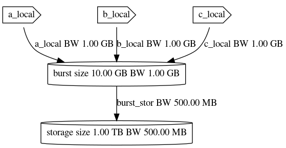
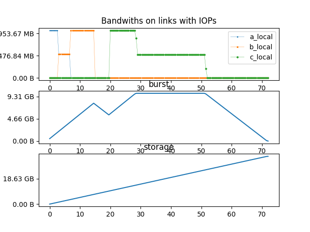
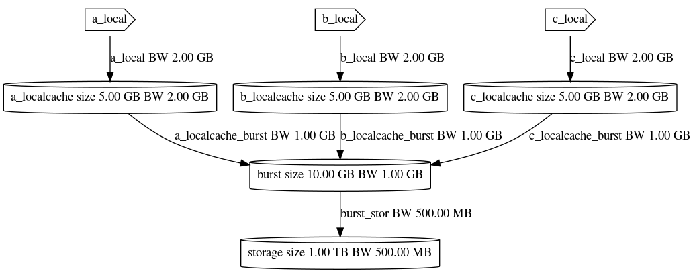

# iosim IO cache simulator

`iosim` aims at simulating arbitrary cache hierarchy using a simple system description language and a list of IO operations to be run. Caches and link between then can have abritrary bandwiths and concurent IOs are supposed to be "fair" between links, equally splitting bandwidth.

## TL;DR

```sh
# Install iosim (and potential missing deps)
pip install .

# get simulation graph
iosim -c ./examples/burst.io --ops ./examples/sim.ops 

# Same but output in a file
iosim -c ./examples/burst.io --ops ./examples/sim.ops -o out.pdf

# Generate a Graphviz (.dot) file describing IO system
iosim -c ./examples/burst.io -g burst.dot
# Use graphviz to generate the final image
dot -Tpng ./burst.dot -o burst.png
```

Dot output:



Simulation output (using example IO operations below):




## Sample Usage

`iosim` requires two JSON files to perform a simulation :
* a system description defining caches and links between caches. This files has a `.io` extension
* **when running a simulation** a list of operations is required (stored as `.ops` for convienience).

Note size fields support `K,M,G,T` sufixes to perform automatic unit conversion.

### The system definition file

```json
{
    "caches": {
        "storage" : {"bw": "500M", "size": "1T"}
    },
    "links": {
        "a_local": {"bw":"1G", "to": "storage"},
        "b_local": {"bw":"1G", "to": "storage"},
        "c_local": {"bw":"1G", "to": "storage"},
    }
}
```

* `caches` is a dict of storage elements with different names
    * `bw` the maximum write bandwidth on this cache
    * `size` the size of the cache
* `links` is a list of links between caches
    * `bw` is the link bandwidth (can be limited by target cache)
    * `from` (optional) is the source cache for this link (name in `caches` dict)
    * `to` is the destination cache for this link (name in `caches` dict)

Here is a more complex example:

```json
{
    "caches": {
        "burst" : {"bw": "1G", "size": "10G"},
        "storage" : {"bw": "500M", "size": "1T"},
        "a_localcache" : {"bw": "2G", "size": "5G"},
        "b_localcache" : {"bw": "2G", "size": "5G"},
        "c_localcache" : {"bw": "2G", "size": "5G"}

    },
    "links": {
        "a_local": {"bw":"2G", "to": "a_localcache"},
        "b_local": {"bw":"2G", "to": "b_localcache"},
        "c_local": {"bw":"2G", "to": "c_localcache"},
        "a_localcache_burst": {"bw":"1G", "from":"a_localcache", "to": "burst"},
        "b_localcache_burst": {"bw":"1G", "from":"b_localcache", "to": "burst"},
        "c_localcache_burst": {"bw":"1G", "from":"c_localcache", "to": "burst"},
        "burst_stor": {"bw":"1G", "from": "burst", "to" : "storage"}
    }
}
```

Yielding the following configuration (generated with the tool itself):



### The Operation Definition File

Here is a sample file:

```json
{
    "reference":"storage",
    "tick": 0.5,
    "ops": [
        ["a_local", "5G", 0.0],
        ["b_local", "10G", 3.0],
        ["c_local", "20G", 20.0]
    ]
}
```

* `reference` defines the cache to monitor for storing all data send using the various `ops`. It defines the simulation stop condition (usually the lowest cache)
* `tick` this defines the simulation timestep
* `ops` a list of IO operations
    * Each IO operation is an array of three elements:
        * the name of the link to write on (as in `links` dict) (STRING)
        * the volume of data to write (STRING)
        * the time offset for this operation to start in seconds (FLOAT)